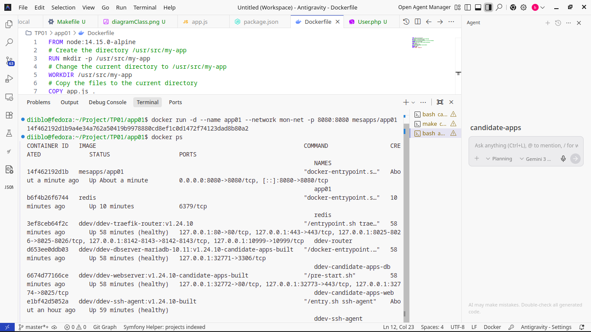
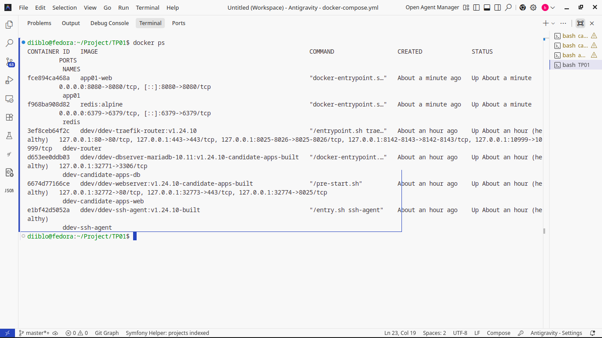
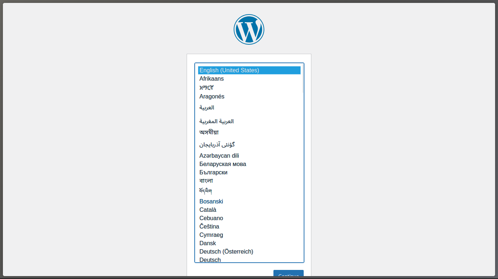
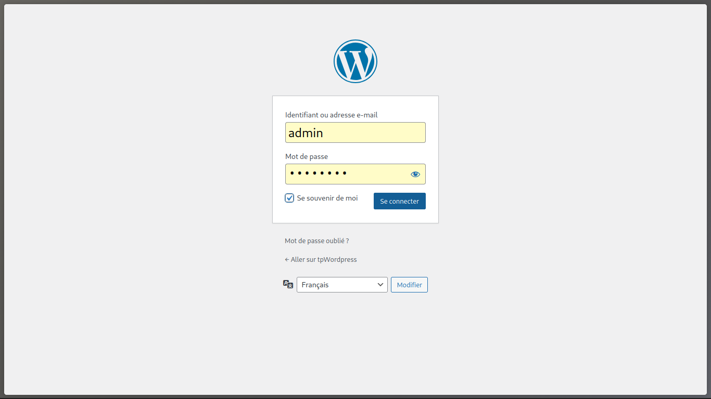
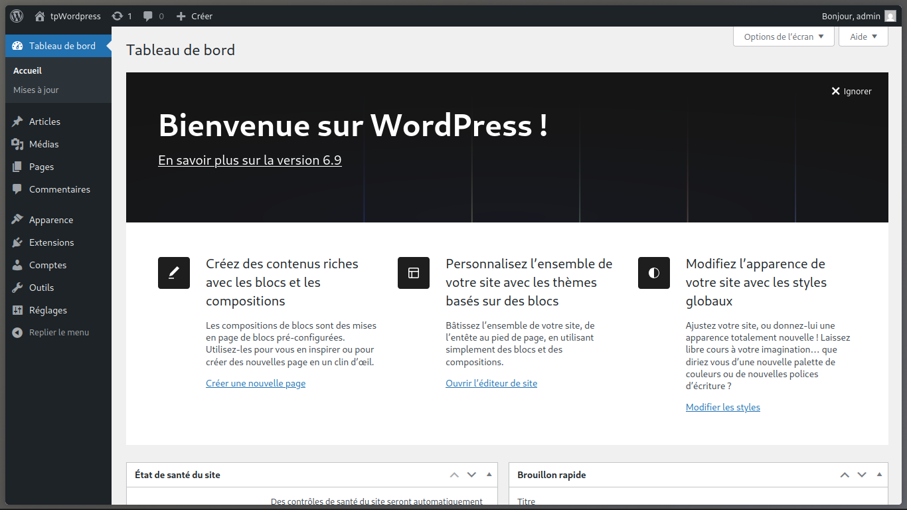
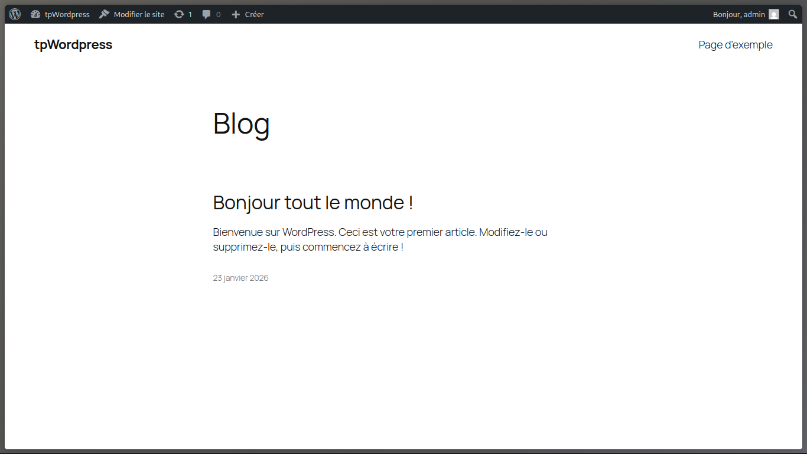

# Rapport de TP — Docker avancé

> **Étudiant :** `King Rahman Moctarr Basiru`

> **Groupe / Promo :** `4ème année Teach Lead`

> **Encadrant :** ` TCHOKOMENI VEIGNE Jean Christophe`

> **Date :** `23/01/2026`

> **Machine / OS :** `Fedora`

---

## 1. Contexte et objectifs

Dans le cadre de l’apprentissage de **Docker (niveau avancé)**, il nous a été demandé de réaliser un TP afin de **mettre en pratique** les notions vues en cours.

### Objectifs visés

* Valider l’exécution correcte des commandes Docker de base et avancées.
* Déployer une application **sans** `docker-compose.yml` (approche “manuelle”).
* Déployer une application **avec** `docker-compose.yml` (approche déclarative).
* Installer **WordPress** avec ses composants nécessaires.
* Mettre en place un **volume** pour assurer la **persistance des données**.

---

## 2. TP 01 — Déploiement sans docker-compose

### 2.1 Description

Le TP 01 consistait à vérifier le bon fonctionnement de nos commandes Docker et à configurer un **cluster / ensemble de conteneurs applicatifs** sans utiliser de fichier `docker-compose.yml`.

### 2.2 Démarche (résumé)

* Création et lancement des conteneurs via le terminal.
* Vérification de l’état des conteneurs (actifs / arrêtés).
* Validation de l’accès à l’application et des communications éventuelles entre services.

### 2.3 Résultats attendus

* Les conteneurs démarrent sans erreur.
* Les services sont accessibles (ports exposés / réseau correct).
* L’état des conteneurs est cohérent avec la configuration.

---

## 3. TP 02 — Déploiement avec docker-compose

## 3.1 Partie 01 — Reprise du TP 01 avec docker-compose.yml

### 3.1.1 Description

Dans cette partie, il nous a été demandé de configurer un fichier **`docker-compose.yml`** afin de lancer l’application **sans créer les conteneurs manuellement** via le terminal.

### 3.1.2 Démarche (résumé)

* Création du fichier `docker-compose.yml`.
* Définition des services (images, ports, variables d’environnement, réseaux, dépendances).
* Lancement via `docker compose up` et vérification du statut.

### 3.1.3 Points importants à retenir

* Le `docker-compose.yml` centralise la configuration et rend le déploiement **reproductible**.
* La gestion des dépendances (ex. `depends_on`) simplifie l’orchestration.

---

## 3.2 Partie 02 — Installation de WordPress

### 3.2.1 Description

Même logique que la partie 01, mais appliquée à une installation **WordPress**, incluant :

* ses composants nécessaires (ex. base de données),
* et l’utilisation d’un **volume** pour assurer la persistance des données.

### 3.2.2 Architecture (à compléter)

* Service WordPress : `wordpress:latest`
* Service base de données : `mariadb:10`
* Réseau : `wordpress-network`
* Volumes : `mariadb_data + wordpress_data`

### 3.2.3 Démarche (résumé)

* Définition des services WordPress + DB dans `docker-compose.yml`.
* Ajout des variables d’environnement nécessaires.
* Montage d’un volume pour :

  * les fichiers WordPress **et/ou**
  * les données de la base (selon choix).
* Installation via navigateur puis vérification de la persistance.


---

## 4. Conclusion

Nous pouvons conclure que la configuration préalable d’un fichier **`docker-compose.yml`** facilite fortement la mise en place d’un environnement Docker : elle rend le déploiement **plus rapide**, **plus lisible** et **réplicable**.
De plus, l’utilisation d’un **volume** est essentielle pour garantir la **persistance des données** : même après suppression des conteneurs, les informations restent disponibles, ce qui est indispensable pour des applications comme WordPress.

---

## 5. Annexes — Captures d’écran

### TP 01


*Légende :* `[ Tout communique]`


*Légende :* `[ liste des conteneurs / status]`

### TP 02 — WordPress


*Légende :* `[liste des conteneurs / status pour TP 2]`


*Légende :* `[liste des conteneurs / status pour TP 2]`


*Légende :* `[écran de configuration]`


*Légende :* `[connexion admin]`


*Légende :* `[installation terminée]`


*Légende :* `[preuve de persistance après relance]`

---

### Extrait docker-compose.yml (à insérer)

```yaml
version: '3'
services:
  db:
    image: mariadb:10
    volumes:
    ##
    # Ajoutez un volume pour MariaDB data (répertoire /var/lib/mysql)
    ##
    - mariadb_data:/var/lib/mysql
    ##
    restart: always
    environment:
    ##
    # Ajoutez les variables d'environnement pour accès à la base MariaDB
    ##
    - MYSQL_ROOT_PASSWORD=1234
    - MYSQL_DATABASE=wordpress
    - MYSQL_USER=wordpress
    - MYSQL_PASSWORD=1234
    networks:
    - wordpress_network

  dbadmin:
    image: phpmyadmin/phpmyadmin

    ports:
    - "8080:80"
    
    environment:
    ##
    # Ajoutez les variables d'environnement pour MariaDB+PHPMyAdmin
    ##
      PMA_HOST: db
      PMA_PORT: 3306
      MYSQL_ROOT_PASSWORD: rootpassword

    depends_on:
    ##
    # Ajouter les dépendances
    ##
    - db
    networks:
    - wordpress_network

  wordpress:
    image: wordpress:latest

    depends_on:
    ##
    # Ajouter les dépendances
    ##
    - db

    networks:
    - wordpress_network

    ports:
    - "8081:80"

    restart: always

    environment:
    ##
    # Ajoutez les variables d'environnement pour accéder à la base de données MariaDB
    - WORDPRESS_DB_HOST=db:3306
    - WORDPRESS_DB_USER=wordpress
    - WORDPRESS_DB_PASSWORD=1234
    - WORDPRESS_DB_NAME=wordpress

    volumes:
      - wordpress_data:/var/www/html

volumes:
  mariadb_data:
  wordpress_data:

networks:
  wordpress_network:
    driver: bridge


```
